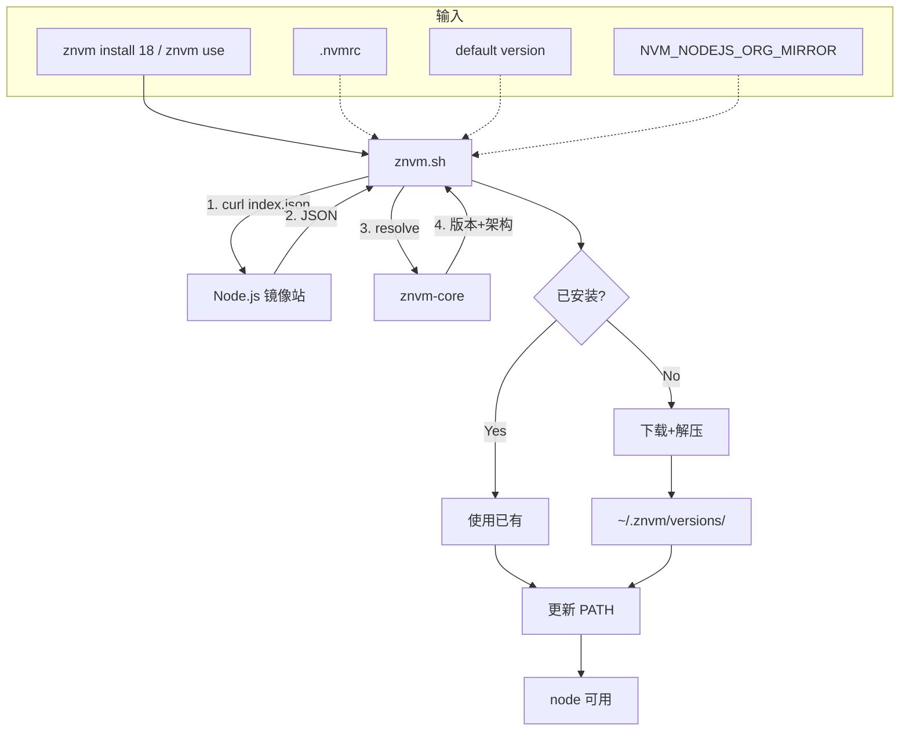

# znvm (Zig Node Version Manager)

**znvm** 是一个极简、高性能的 Node.js 版本管理器，专为追求速度和简洁的开发者设计。

**znvm** is a minimalist, high-performance Node.js version manager designed for developers who value speed and simplicity.

它结合了 **Zig** 的高性能（用于处理复杂的 SemVer 解析和架构匹配）与 **Shell** 的灵活性（用于环境切换和网络下载），提供极致的体验。

It combines the high performance of **Zig** (handling complex SemVer parsing and architecture matching) with the flexibility of **Shell** (managing environment switching and network downloads) to deliver an ultimate experience.

## ✨ 特性 / Features

- 🚀 **极速 / Blazing Fast**: 核心逻辑由 Zig 编写，启动和解析速度极快。
  - Core logic written in Zig for extremely fast startup and resolution.
- 🧠 **智能 / Smart**: 支持 SemVer 语义化版本（如 `znvm install 18` 自动匹配最新 `v18.x.x`）。
  - Supports SemVer semantic versioning (e.g., `znvm install 18` automatically matches the latest `v18.x.x`).
- 🍎 **Apple Silicon 友好 / Apple Silicon Friendly**: 自动检测架构，并在 Node.js 旧版本（如 v14）缺失 arm64 构建时自动回退到 Rosetta (x64) 模式。
  - Automatically detects architecture and falls back to Rosetta (x64) mode for older Node.js versions (e.g., v14) missing arm64 builds.
- 🐧 **多平台 / Multi-Platform**: 支持 macOS (Apple Silicon/Intel) 和 Linux。
  - Supports macOS (Apple Silicon/Intel) and Linux.
- ⚡ **简洁 / Simple**: 仅需一个命令别名 `nv` 即可完成所有操作。
  - Requires only a single command alias `nv` for all operations.
- 🇨🇳 **本地化 / Localized**: 全中文/英文双语输出提示。
  - Full Chinese/English bilingual output prompts.

## 📦 安装 / Installation

### 自动安装 (推荐) / Automatic Installation (Recommended)

```bash
# 安装最新版本 / Install latest version
curl -fsSL https://raw.githubusercontent.com/charlzyx/znvm/main/install.sh | bash

# 安装指定版本 / Install specific version
curl -fsSL https://raw.githubusercontent.com/charlzyx/znvm/main/install.sh | bash -s -- v0.1.0
```

### 手动安装 / Manual Installation

1. 克隆仓库：
   Clone the repository:
   ```bash
   git clone https://github.com/charlzyx/znvm.git ~/.znvm
   ```

2. 将以下内容添加到你的 Shell 配置文件 (`~/.zshrc`, `~/.bashrc` 等)：
   Add the following to your Shell configuration file (`~/.zshrc`, `~/.bashrc`, etc.):
   ```bash
   export ZNVM_ROOT="$HOME/.znvm"
   source "$ZNVM_ROOT/znvm.sh"
   
   # 推荐配置别名 / Recommended alias configuration
   alias nv=znvm
   ```

3. 重启 Shell 或执行 `source ~/.zshrc`。
   Restart your Shell or run `source ~/.zshrc`.

**注意**: 初次运行时，znvm 会自动检测并编译核心 Zig 工具（需要安装 [Zig](https://ziglang.org/download/)）。

**Note**: On the first run, znvm will automatically detect and compile the core Zig tools (requires [Zig](https://ziglang.org/download/) installed).

## 🛠 使用指南 / Usage Guide

### 基础命令 / Basic Commands
```bash
# 安装最新的 Node.js 20
znvm install 20

# 切换到 Node.js 18
znvm use 18

# 列出已安装的本地版本
# -> 前缀 = 当前使用版本，[default] 后缀 = 默认版本
znvm ls

# 设置默认版本为 20 (新开终端自动生效)
znvm default 20
```

**`znvm use` 优先级**：参数 > `.nvmrc` > `default version`
```bash
znvm use 20        # 使用指定版本
znvm use           # 先尝试 .nvmrc，否则使用 default version
```

### 示例/example
```bash
$ nv ls
[znvm] (无)
--------------------------------------------------------------------------------------------------

$ nv install 12
[znvm] 12 -> v12.22.12 (x64)
[znvm] 下载 v12.22.12...
########################################################################################### 100.0%
[znvm] 已安装 v12.22.12
--------------------------------------------------------------------------------------------------

$ nv install 22
[znvm] 22 -> v22.22.0 (arm64)
[znvm] 下载 v22.22.0...
########################################################################################### 100.0%
[znvm] 已安装 v22.22.0
--------------------------------------------------------------------------------------------------

$ nv default 22
[znvm] 设置默认版本: 22 (在新会话中生效)
--------------------------------------------------------------------------------------------------

$ nv use 12
[znvm] 12 -> v12.22.12 (x64)
[znvm] v12.22.12 已安装
[znvm] node@v12.22.12 npm@6.14.16
--------------------------------------------------------------------------------------------------

$ nv ls
-> v12.22.12
   v22.22.0 [default]
```

### 高级配置 / Advanced Configuration

#### 1. 简写别名 / Shorthand Alias
建议配置 `nv` 别名以获得更佳体验：
It is recommended to configure the `nv` alias for a better experience:
```bash
alias nv=znvm
```

#### 2. .nvmrc 支持 / .nvmrc Support
当目录下存在 `.nvmrc` 文件时，执行无参数的 `use` 命令即可自动切换：
When an `.nvmrc` file exists in the directory, running `use` without arguments will automatically switch versions:
```bash
# 假设 .nvmrc 内容为 "18" / Assuming .nvmrc content is "18"
cd my-project
znvm use
# -> 自动切换到 v18.x.x / Automatically switches to v18.x.x
```

#### 3. 镜像源加速 / Mirror Acceleration
支持设置 `NVM_NODEJS_ORG_MIRROR` 环境变量来加速版本解析和下载：
Supports setting the `NVM_NODEJS_ORG_MIRROR` environment variable to accelerate version resolution and downloading:
```bash
export NVM_NODEJS_ORG_MIRROR=https://npmmirror.com/mirrors/node
```

### 核心工具命令 / Core Tool Commands
znvm 的 Zig 核心 (`znvm-core`) 提供独立的 SemVer 处理命令：
The Zig core provides standalone SemVer processing commands:

```bash
znvm-core
├── resolve <version>       - 从远程 index.json 解析（含架构检测）
└── semver
    ├── compare <v1> <v2>   - 比较两个版本
    └── match <query>       - 从 stdin 列表匹配最佳版本

# 比较两个版本 / Compare two versions
# 输出: -1 (v1<v2), 0 (相等), 1 (v1>v2)
znvm-core semver compare v18.0.0 v20.0.0

# 从版本列表中匹配最佳版本 / Match best version from list
echo -e "v18.20.0\nv20.10.0" | znvm-core semver match 20
# 输出: v20.10.0
```

## 🏗 架构设计 / Architecture Design

znvm 采用 **混合架构** (Hybrid Architecture) 设计：
znvm uses a **Hybrid Architecture** design:

1.  **Core (Zig)**: `src/main.zig` -> `bin/znvm-core`
    *   **`resolve <version>`**: 从远程 `index.json` 解析最佳版本（含架构检测、Rosetta 回退）。
    *   **`semver compare <v1> <v2>`**: 比较两个 SemVer 版本，输出 `-1/0/1`。
    *   **`semver match <query>`**: 从本地版本列表中匹配最佳版本。
    *   **优势**: Zig 解析 JSON 和版本比 Shell 快且安全；支持交叉编译。

2.  **Shell Wrapper**: `znvm.sh`
    *   **职责 / Responsibility**: 负责"IO 与环境操作" / Handles "IO and environment operations".
    *   **功能 / Functions**:
        *   管理 `PATH` 环境变量。 / Manages `PATH` environment variables.
        *   使用 `curl` 获取远程版本列表和下载二进制包（自动复用系统代理配置）。 / Uses `curl` to fetch remote version lists and download binaries (automatically reuses system proxy settings).
        *   提供用户交互界面。 / Provides user interaction interface.



## 🔨 开发与构建 / Development & Build

如果你想参与开发：
If you want to contribute:

1. 确保安装了 Zig (0.13.0+)。 / Ensure Zig (0.13.0+) is installed.
2. 运行构建： / Run build:
   ```bash
   zig build -Doptimize=ReleaseSafe
   ```

## 📄 License

MIT
